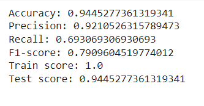
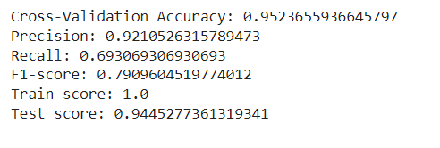
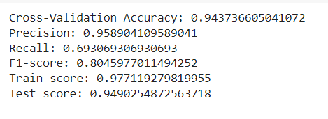
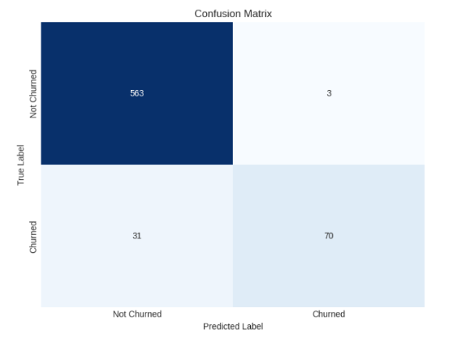
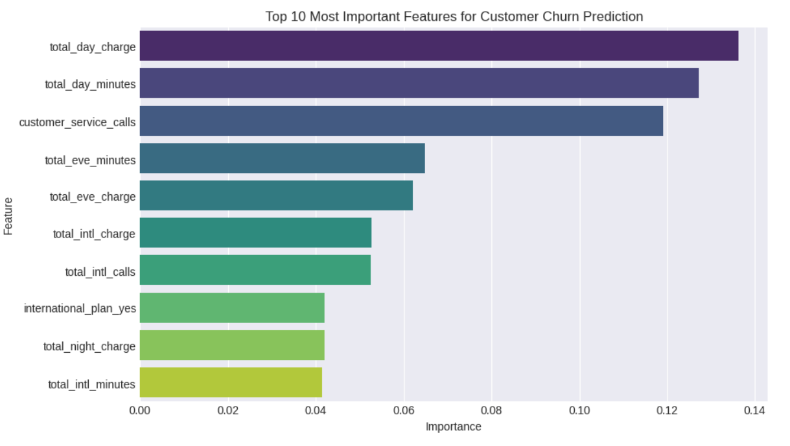
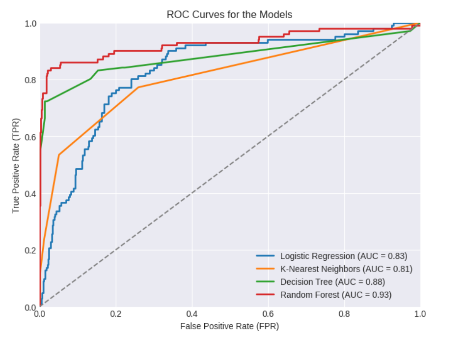

# Reducing Customer Churn: Using Machine Learning to Predict Customer Retention at Syriatel Mobile Telecom

**Authors:** Edward Opollo, Cynthia Nasimiyu, John Karanja, Sheilah Machaha, Julius Charles, Sharon Kimutai, Phelix Okumu

## Project Overview

The project uses the SyriaTel Telecoms dataset to build a classification model that determines whether a customer will ("soon") stop doing business with SyriaTel, a telecommunications company. This is a binary classification problem.

A 2014 article, called The Value of Keeping the Right Customers, written by Amy Gallo stresses the importance of any business investing more to retain existing customers (avoiding customer churning) than acquiring new ones. Gallo maintains that it costs from 5 to 25 times more to acquire a new customer than retain an existing one while retaining existing clients by 5% results in profits augmenting by 25% to 95%.

Through this project, we are building a prediction model that identifies patterns in customer churning, which can be helpful in developing mitigation strategies.

## Business Understanding

The telecommunication industry has become very competitive, particularly with emerging technological innovations that have given customers alternative communication channels. We aim at creating a predictive business model which would enable Syriatel to adopt strategies that would reduce churn, and maintain and grow its customer base, in a bid to sustain overall growth and profitability.
As the principal stakeholder, the company stands to benefit from this model through a reduction in customer churning rates, which has the potential to increase revenues and profits, promote growth, and sustain, or rather, increase its market position. The customers will also benefit through improved telecommunication services, not forgetting better customer service. As the company continues to grow, through revenues, profits, increased customers, and higher market share, the shareholders will also get more returns on their investments (ROI) while employees benefit from better remunerations and bonuses.

**Research Objectives**

To identify the key features that determine if a customer is likely to churn.
To determine the most suitable model to predict Customer Churn.
To establish customer retention strategy to reduce churn

## The Data

The SyriaTel Customer Churn dataset is from Kaggle and can be found in the data folder. The dataset contains 3333 entries and 21 columns. 
This dataset contains information about customers of a telecom company, including their state, account length, area code, phone number, and whether they have international and voice mail plans. 
The dataset also includes information about the number of voicemails the customer has sent, the total number of minutes, calls, and charges for day, evening, and night calls, as well as the total number of minutes, calls, and charges for international calls. 
Additionally, the dataset includes information about the number of calls the customer has made to customer service.

## Data Preparation
The analysis performed on the dataset included the following steps:
Data Cleaning: The dataset was checked per column to find missing values, duplicates, and outliers and we dealt with them accordingly
Data Transformation: Categorical data in the churn column was converted into numerical data.
Exploratory Data Analysis: Univariate, bivariate, and multivariate analysis was done on the data to check the distribution of features and the target and to identify possible correlations between features  
Feature Engineering: Certain columns were transformed to enhance their usefulness. This included;
Encoding categorical variables into numerical representations e.g area_code, international_plan, voice_mail_plan 
Normalization and Scaling features to a consistent range using the StandardScaler

By performing these steps, we aimed to gain a comprehensive understanding of the dataset and prepare it for further analysis and modeling

## Modeling
During the analysis, we developed and evaluated four classification models to gain insights and make predictions. Here is an overview of the models:

### Model 1: Logistic Regression Model
**Baseline model**
The first logistic regression model was built using default parameters. The model accrued 86% training accuracy and 86% for test accuracy. The recall was 18%, precision 60% and 27% F1 Score.
 
**Logistic model addressing class imbalance**
We tried to improve the model performance by addressing class imbalance using class weight ‘balanced’. Train Accuracy was 0.77, test accuracy 0.78. The precision was 39%, recall 77% and an F1 score of 51%. This was the selected model for logistic regression.

### Model 2: K-Nearest Neigbors
**KNN Baseline Model**
The first  K-Nearest Neighbors model was built with default parameters. The model achieved an accuracy of 87.4%, a precision of 77.42%, a recall of 23.7%,  and an F1-score of 36.3%. The model's training score is 91%, and its test score is 87.4%

**KNN Grid search and hyperparameter tuning**
Here we were looking to find the best parameters for the model. The n_neighbors(K value) parameter, weight, and distance metric to use. We also did cross-validation to avoid overfitting. The best-performing parameters of the K-nearest neighbors (KNN) model with hyperparameters {'n_neighbors': 7, 'p': 1, 'weights': 'distance'} achieved an accuracy of 88.4%, precision of 80%, recall of 31.6%, and F1-score of 45.39% on the test data, with a training score of 100% and testing score of 88%. This model overfit the training data meaning it wasnt the best to use for unseen data.

**KNN Ensemble Methods**
To improve the KNN models, we combined multiple KNN models by using the ensemble technique Bagging to create a more robust and accurate classifier. The performance metrics for the model are as follows: Accuracy: 88%; Precision: 80%; Recall: 27.71%; F1-score: 41.17%. Additionally, the model's training score is 91.22%, and its test score is 88%.
This emerged as the best KNN model, although the recall score was quite low

## Model 3: Decision Tree Classifier
**Baseline Model**
The baseline model used the default parameters to train and test the model. The train score was 1 indicating the model was overfitting and a test score of 0.91. The model has an accuracy of 0.91, precision of 0.71, recall of 0.75 and an F1 score of 0.73.

**Improving the model using SMOTE**
We tried to improve the baseline model by addressing class imbalance using SMOTE. 
After including SMOTE, the model had a train score of 1.0 where it was still overfitting and a test score 0.89. The accuracy was 0.89, precision 0.63, recall 0.76 of and an F1 score of 0.69. 

**Improving the model using GridSeachCV**
We tried to improve the model further by using GridSearchCV to get the best hyperparameters. We also included 5-fold cross validation to deal with overfitting. The model performed fairly well with a train score of 0.96 and a test score of 0.94. The accuracy was 0.94,  precision 0.90, recall 0.73 and an F1 score 0.80. This was the best decision tree classifier model.

### Model 4: Random Forest Classifier
**Baseline Model**
This project utilizes the Random Forest machine learning algorithm to predict customer churn. It analyzes customer behavior and key features to determine the likelihood of customers leaving the service. The Random Forest model is chosen for its accuracy and ability to handle complex relationships in the data.

**Using k-fold cross-validation to address overfitting**
To address overfitting, K-fold cross-validation was employed for the Random Forest model. This technique helps assess the model's robustness and generalization by splitting the data into K subsets and iteratively training and testing the model on different combinations.

**Random Forest classifier with reduced n_estimators and limited max_depth**
To tackle overfitting, adjustments were made to the parameters of the Random Forest classifier, reducing the number of trees (n_estimators) and constraining the maximum depth of each tree (max_depth). These modifications aimed to create a simpler and less complex model, improving its ability to generalize to new data and reduce overfitting.

Based on the provided metrics, the Decision Trees Classifier achieved the highest accuracy (95.00%) and F1-score (81.00%). The logistic regression had the highest recall (73.00%), while the Random Forest Classifier achieved the highest precision (96.00%).  The Random Forest Classifier is the best-performing model overall and so we selected it as our best model.

The ROC curves for Logistic Regression, K Nearest Neighbors, Decision Tree, and Random Forest models were analyzed. The Random Forest model outperformed the others, showing a higher Area Under the Curve (AUC) and better classification performance, making it the most effective model 

## Conclusions & Recommendations
In conclusion, the analysis suggests that we can accurately predict customer churn using a machine learning model, with the Random Forest Classifier being our recommended model due to its strong overall performance. As this is the best-performing model with a ROC curve that hugs the upper left corner of the graph, hence giving us the largest AUC (Area Under the curve).

1. We would recommend that Syriatel make use of the Random Forest Classifier as the primary model for predicting customer churn. This model has a higher ROC curve and strong overall performance in terms of accuracy, F1-score, recall, and precision on the test set, making it well-suited for accurately classifying customers as likely or unlikely to churn.

2. In terms of Business strategic recommendations for SyriaTel, we would recommend a Customer Retention strategy that addresses key features in relation to call minutes and charges. These efforts could include personalized offers or discounts on day charges. By implementing cost-effective strategies that address the key factors driving customer churn, SyriaTel can retain customers and minimize revenue loss.

3. We would recommend, that Syriatel comes up with strategies to reduce on Customer Service calls, as this is among the top features that would likely lead to Customer Churn. Example: come up IVR (Interactive Voice Response) and DIY (Do It Yourself) solutions.
